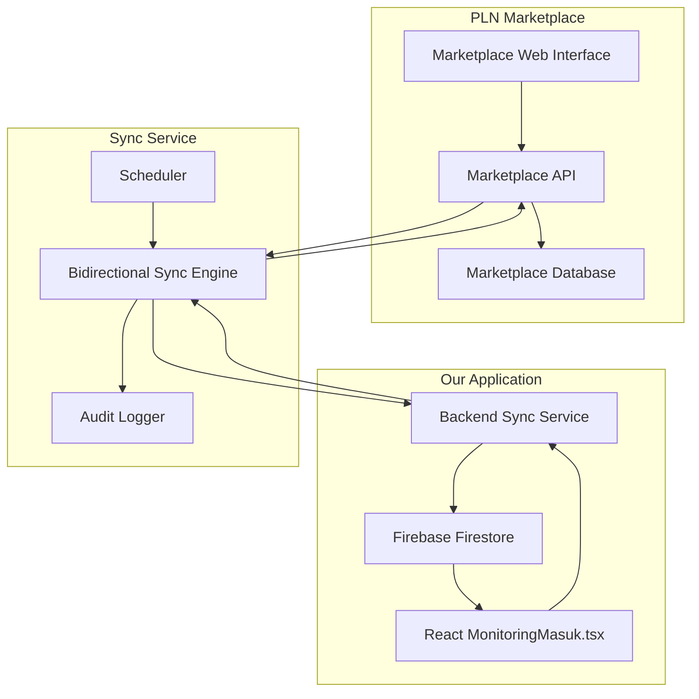

# PLN Marketplace Exploration Report
*Comprehensive Analysis for Bidirectional Material Tracking Integration*

**Date**: June 11, 2025  
**Marketplace URL**: https://marketplace.pln.co.id/  
**Objective**: Bidirectional sync between our material tracking app and PLN Marketplace  
**Status**: 🔄 In Progress

---

## 📋 Table of Contents
1. [Executive Summary](#executive-summary)
2. [Authentication & Access](#authentication--access)
3. [Menu Structure Analysis](#menu-structure-analysis)
4. [Data Schema Documentation](#data-schema-documentation)
5. [API Endpoints Discovery](#api-endpoints-discovery)
6. [Bidirectional Sync Opportunities](#bidirectional-sync-opportunities)
7. [Technical Implementation Plan](#technical-implementation-plan)
8. [Security Considerations](#security-considerations)
9. [Integration Architecture](#integration-architecture)
10. [Recommendations](#recommendations)
11. [Appendices](#appendices)

---

## 🎯 Executive Summary

### Key Objectives
- **Primary Goal**: Establish bidirectional sync between our app and PLN Marketplace
- **Data Flow**: Marketplace ↔ Our Application
- **Focus Areas**: Material tracking, delivery status, supplier management
- **Integration Type**: Real-time bidirectional synchronization

### Expected Outcomes
- [ ] Real-time material tracking from marketplace
- [ ] Automatic status updates from our app to marketplace
- [ ] Delivery schedule synchronization
- [ ] Supplier performance metrics integration
- [ ] Automated notifications and alerts

---

## 🔐 Authentication & Access

### Login Process
- **URL**: `https://marketplace.pln.co.id/login`
- **Method**: [To be documented]
- **Authentication Type**: [To be analyzed]
- **Session Management**: [To be investigated]
- **Security Features**: [To be documented]

### Credentials
```
Username: [REDACTED - Provided separately]
Password: [REDACTED - Provided separately]
```

### Access Analysis
- **User Role**: [To be determined]
- **Permissions**: [To be documented]
- **API Access**: [To be investigated]
- **Rate Limits**: [To be tested]

---

## 🗂️ Menu Structure Analysis

### Priority Areas for Exploration

#### 1. 🎯 Penerimaan Barang (HIGH PRIORITY)
- **URL**: [To be documented]
- **Purpose**: Material receipt tracking
- **Data Available**: 
  - Supplier information
  - ETD/ETA dates
  - Receipt status
  - Material details
- **Update Capabilities**: [To be tested]
- **API Endpoints**: [To be discovered]

#### 2. 📋 Purchase Order (HIGH PRIORITY)
- **URL**: [To be documented]
- **Purpose**: PO tracking and management
- **Data Available**: [To be analyzed]
- **Integration Points**: [To be identified]

#### 3. 📊 Monitoring (MEDIUM PRIORITY)
- **URL**: [To be documented]
- **Purpose**: Real-time tracking dashboard
- **Features**: [To be documented]

#### 4. 📥 Download Aktivitas Transaksi (MEDIUM PRIORITY)
- **URL**: [To be documented]
- **Format**: [To be analyzed]
- **Data Scope**: [To be tested]

### Complete Menu Map
```
Sidebar Navigation:
├── Pembelian
├── Dashboard
├── EIS
├── Serial Number
├── Purchase Order ⭐
├── Penerimaan Barang ⭐⭐⭐
├── Pengaduan
├── Log SAP
├── Digital Signature
└── Monitoring ⭐
```

---

## 📊 Data Schema Documentation

### Penerimaan Barang Schema
```json
{
  "table_name": "penerimaan_barang",
  "primary_key": "[To be identified]",
  "columns": [
    {
      "name": "supplier",
      "type": "string",
      "example": "PT SUCACO TBK",
      "nullable": false,
      "description": "Supplier company name"
    },
    {
      "name": "etd",
      "type": "date",
      "example": "2025-06-11",
      "nullable": true,
      "description": "Estimated Time Departure"
    },
    {
      "name": "eta",
      "type": "date",
      "example": "2025-06-25",
      "nullable": true,
      "description": "Estimated Time Arrival"
    },
    {
      "name": "rating",
      "type": "string",
      "example": "-",
      "nullable": true,
      "description": "Supplier rating"
    },
    {
      "name": "status_penerimaan",
      "type": "enum",
      "example": "PROCCESSED",
      "nullable": false,
      "values": ["PROCCESSED", "PENDING", "DELIVERED", "[Others to be discovered]"],
      "description": "Material receipt status"
    }
  ]
}
```

### Sample Data Records
```json
[
  {
    "supplier": "PT SUCACO TBK",
    "etd": "2025-06-11",
    "eta": "2025-06-25",
    "rating": "-",
    "status_penerimaan": "PROCCESSED",
    "material_details": "[To be extracted]",
    "po_number": "[To be identified]",
    "tracking_id": "[To be found]"
  }
]
```

---

## 🔌 API Endpoints Discovery

### Authentication Endpoints
```http
POST /api/auth/login
Content-Type: application/json

Request:
{
  "username": "...",
  "password": "...",
  "csrf_token": "[To be analyzed]"
}

Response:
{
  "token": "...",
  "expires_in": "...",
  "user_info": {...}
}
```

### Data Retrieval Endpoints
```http
GET /api/penerimaan
Headers:
  Authorization: Bearer [token]
  X-CSRF-Token: [token]

Response:
{
  "data": [...],
  "pagination": {...},
  "filters": {...}
}
```

### Status Update Endpoints (Bidirectional Sync)
```http
PUT /api/penerimaan/{id}/status
Content-Type: application/json

Request:
{
  "status": "DELIVERED",
  "notes": "Material received and verified",
  "timestamp": "2025-06-11T10:30:00Z",
  "received_by": "Admin Gudang",
  "quantity_received": 100
}

Response:
{
  "success": true,
  "updated_at": "2025-06-11T10:30:00Z",
  "new_status": "DELIVERED"
}
```

---

## 🔄 Bidirectional Sync Opportunities

### 1. Marketplace → Our App (Real-time Data Pull)
```typescript
interface MarketplaceToApp {
  // Data yang akan di-sync dari marketplace ke aplikasi kita
  supplier_updates: {
    eta_changes: boolean;
    status_updates: boolean;
    delivery_delays: boolean;
    new_shipments: boolean;
  };
  
  // Frequency: Every 15-30 minutes
  sync_method: 'api_polling' | 'webhook' | 'websocket';
  
  // Data transformation
  data_mapping: {
    marketplace_field: string;
    our_app_field: string;
    transformation_rule?: string;
  }[];
}
```

### 2. Our App → Marketplace (Status Updates Push)
```typescript
interface AppToMarketplace {
  // Trigger events dari aplikasi kita
  material_received: {
    trigger: 'user_confirms_receipt';
    marketplace_action: 'update_status_to_delivered';
    required_data: ['po_number', 'quantity', 'receipt_date', 'received_by'];
  };
  
  material_inspected: {
    trigger: 'quality_check_completed';
    marketplace_action: 'update_inspection_status';
    required_data: ['inspection_result', 'notes', 'inspector'];
  };
  
  material_stored: {
    trigger: 'material_added_to_inventory';
    marketplace_action: 'update_storage_status';
    required_data: ['storage_location', 'bin_location'];
  };
}
```

### 3. Conflict Resolution Strategy
```typescript
interface ConflictResolution {
  // Ketika ada konflik data antara marketplace dan aplikasi kita
  resolution_rules: {
    'status_mismatch': 'marketplace_wins' | 'our_app_wins' | 'manual_review';
    'eta_difference': 'latest_timestamp_wins';
    'quantity_mismatch': 'manual_review_required';
  };
  
  // Audit trail untuk semua perubahan
  audit_logging: {
    source: 'marketplace' | 'our_app';
    timestamp: string;
    user: string;
    changes: object;
    sync_direction: 'pull' | 'push';
  };
}
```

---

## 🛠️ Technical Implementation Plan

### Phase 1: Exploration & Discovery (Week 1)
```python
# Exploration script
class PLNMarketplaceExplorer:
    def __init__(self, username: str, password: str):
        self.username = username
        self.password = password
        self.session = requests.Session()
        self.findings = {}
    
    def authenticate(self) -> bool:
        """Test authentication and session management"""
        # Implementation to be added
        pass
    
    def explore_penerimaan_menu(self) -> dict:
        """Deep dive into Penerimaan Barang functionality"""
        # Implementation to be added
        pass
    
    def discover_api_endpoints(self) -> list:
        """Monitor network traffic to find API endpoints"""
        # Implementation to be added
        pass
    
    def test_status_updates(self) -> dict:
        """Test if we can update status from external source"""
        # Implementation to be added
        pass
    
    def generate_report(self) -> str:
        """Generate comprehensive markdown report"""
        # Implementation to be added
        pass
```

### Phase 2: Bidirectional Sync Development (Week 2-3)
```python
# Bidirectional sync service
class PLNMarketplaceBidirectionalSync:
    def __init__(self):
        self.marketplace_client = PLNMarketplaceClient()
        self.firebase_client = FirebaseClient()
        self.sync_config = SyncConfiguration()
    
    async def sync_from_marketplace(self):
        """Pull latest data from marketplace"""
        marketplace_data = await self.marketplace_client.get_penerimaan_data()
        
        for item in marketplace_data:
            # Transform data
            transformed_item = self.transform_marketplace_data(item)
            
            # Update our database
            await self.firebase_client.update_material_tracking(transformed_item)
            
            # Trigger notifications if needed
            if self.detect_important_changes(item):
                await self.send_notification(item)
    
    async def sync_to_marketplace(self, our_app_event: dict):
        """Push updates from our app to marketplace"""
        if our_app_event['type'] == 'material_received':
            # Update marketplace status
            await self.marketplace_client.update_receipt_status(
                po_number=our_app_event['po_number'],
                status='DELIVERED',
                notes=our_app_event['notes']
            )
    
    def transform_marketplace_data(self, marketplace_item: dict) -> dict:
        """Transform marketplace data to our app format"""
        # Implementation based on discovered schema
        pass
```

### Phase 3: Integration with MonitoringMasuk.tsx (Week 4)
```typescript
// Enhanced MonitoringMasuk with bidirectional sync
const EnhancedMonitoringMasuk: React.FC = () => {
  const [marketplaceData, setMarketplaceData] = useState([]);
  const [syncStatus, setSyncStatus] = useState('idle');
  
  // Real-time listener untuk marketplace updates
  useEffect(() => {
    const unsubscribe = onSnapshot(
      collection(db, 'marketplaceSync'),
      (snapshot) => {
        const updates = snapshot.docs.map(doc => ({
          id: doc.id,
          ...doc.data()
        }));
        setMarketplaceData(updates);
      }
    );
    
    return unsubscribe;
  }, []);
  
  // Function untuk update status ke marketplace
  const updateMarketplaceStatus = async (materialId: string, status: string) => {
    setSyncStatus('syncing');
    
    try {
      // Call our backend API yang akan sync ke marketplace
      await fetch('/api/sync-to-marketplace', {
        method: 'POST',
        headers: { 'Content-Type': 'application/json' },
        body: JSON.stringify({
          materialId,
          status,
          timestamp: new Date().toISOString()
        })
      });
      
      setSyncStatus('success');
      message.success('Status berhasil diupdate ke marketplace');
    } catch (error) {
      setSyncStatus('error');
      message.error('Gagal sync ke marketplace');
    }
  };
  
  return (
    <div>
      {/* Existing monitoring features */}
      
      {/* New bidirectional sync features */}
      <Card title="Marketplace Integration" extra={
        <Tag color={syncStatus === 'success' ? 'green' : 'orange'}>
          Sync Status: {syncStatus}
        </Tag>
      }>
        <Timeline>
          {marketplaceData.map(item => (
            <Timeline.Item key={item.id}>
              <div>
                <Text strong>{item.supplier}</Text>
                <br />
                <Space>
                  <Tag color="blue">ETA: {item.eta}</Tag>
                  <Tag color={getStatusColor(item.status)}>
                    {item.status}
                  </Tag>
                </Space>
                <br />
                <Button 
                  size="small" 
                  onClick={() => updateMarketplaceStatus(item.id, 'DELIVERED')}
                  disabled={item.status === 'DELIVERED'}
                >
                  Konfirmasi Diterima
                </Button>
              </div>
            </Timeline.Item>
          ))}
        </Timeline>
      </Card>
    </div>
  );
};
```

---

## 🔒 Security Considerations

### Authentication Security
- **Credential Storage**: Environment variables dengan encryption
- **Session Management**: Automatic token renewal
- **Rate Limiting**: Respect marketplace server limits
- **Error Handling**: Graceful failure dan retry mechanisms

### Data Security
- **Data Encryption**: In-transit dan at-rest encryption
- **Access Control**: Role-based permissions
- **Audit Logging**: Complete audit trail untuk semua sync operations
- **Data Validation**: Input validation untuk prevent injection attacks

### Sync Security
- **Conflict Detection**: Prevent data corruption dari concurrent updates
- **Rollback Capability**: Ability to revert failed sync operations
- **Monitoring**: Real-time monitoring untuk detect anomalies
- **Backup Strategy**: Regular backups sebelum major sync operations

---

## 🏗️ Integration Architecture



---

## 📋 Exploration Checklist

### Authentication & Access
- [ ] Test login process
- [ ] Analyze session management
- [ ] Document authentication flow
- [ ] Test session persistence
- [ ] Identify rate limits

### Menu Exploration
- [ ] **Penerimaan Barang** - Complete analysis
- [ ] **Purchase Order** - Data structure mapping
- [ ] **Monitoring** - Real-time capabilities
- [ ] **Download Aktivitas** - Export functionality
- [ ] Other relevant menus

### API Discovery
- [ ] Monitor network traffic
- [ ] Document all API endpoints
- [ ] Test API authentication
- [ ] Analyze request/response formats
- [ ] Test CRUD operations

### Bidirectional Sync Testing
- [ ] Test read operations (marketplace → our app)
- [ ] Test write operations (our app → marketplace)
- [ ] Verify data consistency
- [ ] Test conflict resolution
- [ ] Document sync limitations

### Integration Planning
- [ ] Design data transformation logic
- [ ] Plan error handling strategies
- [ ] Design monitoring dashboard
- [ ] Create deployment strategy

---

## 🎯 Success Metrics

### Technical Metrics
- **Sync Accuracy**: 99.9% data consistency
- **Sync Latency**: < 5 minutes for status updates
- **Uptime**: 99.5% service availability
- **Error Rate**: < 1% failed sync operations

### Business Metrics
- **Real-time Visibility**: 100% material tracking coverage
- **Process Efficiency**: 50% reduction in manual status updates
- **Data Quality**: 95% reduction in data discrepancies
- **User Satisfaction**: Positive feedback dari logistics team

---

## 📝 Next Steps

### Immediate Actions (This Week)
1. **Complete marketplace exploration** dengan provided credentials
2. **Document all findings** dalam report ini
3. **Test bidirectional sync feasibility**
4. **Create technical specification** untuk development

### Development Phase (Next 2-3 Weeks)
1. **Build sync service prototype**
2. **Integrate dengan existing MonitoringMasuk.tsx**
3. **Test end-to-end workflow**
4. **Deploy to staging environment**

### Production Deployment (Week 4)
1. **Production testing**
2. **User training**
3. **Go-live dengan monitoring**
4. **Post-deployment optimization**

---

## 📎 Appendices

### A. Screenshots
*[Screenshots akan ditambahkan setelah exploration]*

### B. Network Traffic Logs
*[API calls dan responses akan didokumentasikan]*

### C. Code Samples
*[Implementation examples akan ditambahkan]*

### D. Error Scenarios
*[Error handling test results]*

### E. Performance Metrics
*[Load testing results]*

---

**Report Status**: 🔄 In Progress  
**Last Updated**: June 11, 2025  
**Next Update**: After marketplace exploration completion

---

*This document will be continuously updated as we discover more about PLN Marketplace capabilities and integration opportunities.*
