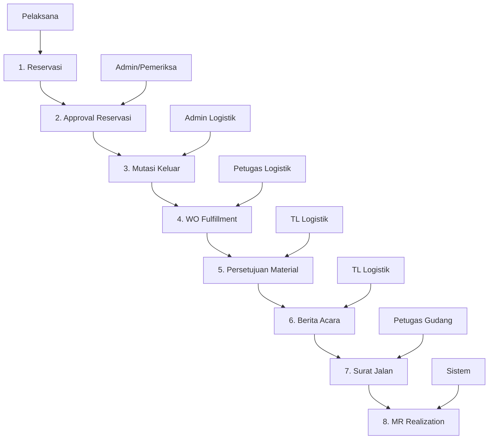
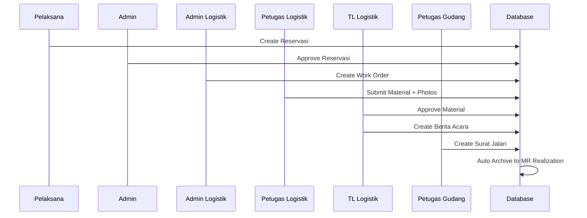

# 📋 Alur Pengeluaran Material - Sistem Logistik PLN UP3 Kupang

## 🔄 Overview Alur Proses

Sistem ini mengelola alur pengeluaran material dari permintaan hingga arsip dengan 8 tahap utama yang terintegrasi.

---

## 📊 Diagram Alur



---

## 🔢 Tahapan Detail

### **1. Reservasi Kebutuhan Material**
**File:** `src/components/Reservasi.tsx`  
**Pengguna:** Pelaksana/Vendor  
**Collection:** `daftarReservasi`

**Proses:**
- Pelaksana membuat permintaan material baru
- Input informasi: nomor kontrak, pekerjaan, lokasi, material yang dibutuhkan
- Generate nomor reservasi otomatis: `001/Gudang UP3 Kupang/Maintenance/I/2025`
- Simpan ke collection `daftarReservasi` dengan status `approved: false`

**Data Structure:**
```javascript
{
  nomorReservasi: "001/Gudang UP3 Kupang/Maintenance/I/2025",
  tanggal: "2025-01-01",
  companyCode: "1000",
  storageLocationDescription: "Gudang UP3 Kupang",
  fungsi: "Maintenance",
  pelaksana: "PT. TEON JAYA",
  nomorKontrak: "044.KON/KR/018.PJ.REN/HKM/.02.01/F20030000/2025",
  deskripsiPekerjaan: "Konstruksi Jaringan Distribusi",
  materials: [
    {
      materialDescription: "ISOLATOR;PINPOST;PORC;24KV;;12.5kN",
      normalisasi: "3070151",
      satuan: "BH",
      qtyPermintaan: 485
    }
  ],
  approved: false,
  printed: false,
  createdAt: "2025-01-01T00:00:00.000Z"
}
```

**Output:** Data reservasi tersimpan dengan status pending approval

---

### **2. Approval Reservasi**
**File:** `src/components/DaftarReservasi.tsx`  
**Pengguna:** Admin/Pemeriksa  
**Collection:** `daftarReservasi` (update)

**Proses:**
- Review daftar reservasi yang masuk dari tahap 1
- Filter berdasarkan tanggal untuk pencarian spesifik
- Verifikasi kelengkapan data dan kebutuhan material
- Approve reservasi dengan konfirmasi modal
- Update status `approved: true` di collection `daftarReservasi`
- Cetak dokumen reservasi setelah diapprove (dengan QR code pemeriksa)
- Upload/Download data reservasi dalam format Excel
- Monitoring status dengan animasi visual (pulse untuk approved, shake untuk pending)

**Fitur Tambahan:**
- **Search by Date** - Filter reservasi berdasarkan tanggal
- **Print Document** - Generate dokumen reservasi dengan template PLN
- **Excel Import/Export** - Upload data dari Excel dan download data existing
- **Template Download** - Download template Excel untuk upload data
- **Visual Status** - Animasi CSS untuk status approved/pending
- **QR Code Integration** - QR code pemeriksa pada dokumen cetak

**Update Data:**
```javascript
{
  approved: true
  // Note: approvedBy dan approvedAt tidak diimplementasi dalam kode saat ini
  // Bisa ditambahkan untuk audit trail yang lebih baik
}
```

**Template Excel untuk Upload:**
```javascript
{
  nomorReservasi: "001/Gudang UP3 Kupang/Maintenance/I/2025",
  tanggal: "2025-01-01", // Format YYYY-MM-DD
  companyCode: "1000",
  storageLocationDescription: "Gudang UP3 Kupang",
  fungsi: "Maintenance",
  pelaksana: "PT. TEON JAYA",
  approved: "TRUE", // atau "FALSE"
  printed: "FALSE",
  materials: "[{\"materialDescription\":\"ISOLATOR\",\"normalisasi\":\"3070151\",\"satuan\":\"BH\",\"qtyPermintaan\":485}]", // JSON string
  nomorKontrak: "044.KON/KR/018.PJ.REN/HKM/.02.01/F20030000/2025",
  deskripsiPekerjaan: "Konstruksi Jaringan Distribusi",
  pemeriksa: "John Doe"
}
```

**Print Document Features:**
- Header dengan logo PLN
- Informasi reservasi lengkap
- Tabel material dengan kolom: No, Material Description, Normalisasi, Satuan, QTY Permintaan, QTY Diberikan, Keterangan
- Footer dengan QR code pemeriksa dan tanda tangan digital
- Format landscape A4 untuk print optimal

**Output:** Reservasi yang diapprove masuk ke tahap selanjutnya

---

### **3. Mutasi Keluar**
**File:** `src/components/MutasiKeluar.tsx`  
**Pengguna:** Admin Logistik  
**Collection:** `workOrders` (create)

**Proses:**
- Tampilkan daftar reservasi yang sudah diapprove
- Admin logistik memproses material secara bertahap
- Pilih material yang akan dilayani dan input qty yang akan diambil
- Bisa menggunakan normalisasi yang sama atau berbeda
- Submit untuk update status material
- Kirim WO (Work Order) ke petugas logistik

**Data Structure WO:**
```javascript
{
  nomorWO: "001/MatKeluar/I/2025",
  nomorReservasi: "001/Gudang UP3 Kupang/Maintenance/I/2025",
  tanggal: "2025-01-01T12:00:00.000Z",
  tanggalDilayani: "2025-01-01T12:00:00.000Z",
  pelaksana: "PT. TEON JAYA",
  materials: [
    {
      materialDescription: "ISOLATOR;PINPOST;PORC;24KV;;12.5kN",
      normalisasi: "3070151",
      valuationType: "Standard",
      qtyAmbil: 100,
      kategori: "Umum"
    }
  ]
}
```

**Output:** 
- Update qty dilayani di reservasi
- Generate Work Order ke collection `workOrders`
- Format nomor WO: `001/MatKeluar/I/2025`

---

### **4. WO Fulfillment**
**File:** `src/components/WOFulfillment.tsx`  
**Pengguna:** Petugas Logistik  
**Collection:** `mrRealization` (create), `workOrders` (delete)

**Proses:**
- Tampilkan daftar Work Order yang perlu dilayani fisik
- Petugas logistik mengambil material fisik dari gudang
- Input detail material: merek, nomor seri (untuk eksklusif), tahun
- Upload 3 foto material (wajib)
- Submit untuk kirim ke persetujuan

**Data Structure MR Realization:**
```javascript
{
  nomorWO: "001/MatKeluar/I/2025",
  nomorReservasi: "001/Gudang UP3 Kupang/Maintenance/I/2025",
  tglPengambilan: "2025-01-01T14:00:00.000Z",
  status: "Completed",
  category: "Umum",
  pelaksana: "PT. TEON JAYA",
  approvalStatus: "Pending",
  submittedAt: "2025-01-01T14:00:00.000Z",
  submittedBy: "PETUGAS LOGISTIK",
  materials: [
    {
      materialDescription: "ISOLATOR;PINPOST;PORC;24KV;;12.5kN",
      normalisasi: "3070151",
      valuationType: "Standard",
      qtyAmbil: 100,
      merek: "BRAND_NAME",
      foto1: "https://firebase-storage-url/foto1.jpg",
      foto2: "https://firebase-storage-url/foto2.jpg",
      foto3: "https://firebase-storage-url/foto3.jpg",
      nomorSeri: "SN123456", // untuk kategori Eksklusif
      tahun: "2025" // untuk kategori Eksklusif
    }
  ]
}
```

**Output:**
- Data material dengan foto tersimpan
- Kirim ke collection `mrRealization` dengan status `approvalStatus: 'Pending'`
- Hapus dari `workOrders` setelah diproses

---

### **5. Persetujuan Material**
**File:** `src/components/PersetujuanMaterial.tsx`  
**Pengguna:** Team Leader Logistik  
**Collection:** `mrRealization` (update)

**Proses:**
- Review material yang sudah diambil fisik
- Verifikasi foto dan detail material
- Approve atau reject pengambilan material
- Update status approval di collection `mrRealization`

**Update Data:**
```javascript
{
  approvalStatus: "Approved", // atau "Rejected"
  approvedBy: "TL Logistik Name",
  approvedAt: "2025-01-01T16:00:00.000Z",
  approvalNotes: "Material sesuai spesifikasi"
}
```

**Output:**
- Status `approvalStatus: 'Approved'` atau `'Rejected'`
- Material yang diapprove lanjut ke tahap berikutnya

---

### **6. Berita Acara**
**File:** `src/components/BeritaAcara.tsx`  
**Pengguna:** Team Leader Logistik  
**Collection:** `beritaAcara` (create)

**Proses:**
- Generate Berita Acara Serah Terima Barang
- Input detail: pihak pertama, pihak kedua, lokasi pengambilan
- Generate nomor BA: `001/LOG.KUANINO/UP3KUP/I/2025`
- Cetak dokumen resmi serah terima

**Data Structure:**
```javascript
{
  nomorBA: "001/LOG.KUANINO/UP3KUP/I/2025",
  tanggal: "2025-01-01T18:00:00.000Z",
  nomorWO: "001/MatKeluar/I/2025",
  nomorReservasi: "001/Gudang UP3 Kupang/Maintenance/I/2025",
  nomorKontrak: "044.KON/KR/018.PJ.REN/HKM/.02.01/F20030000/2025",
  pekerjaan: "Konstruksi Jaringan Distribusi",
  lokasi: "Univ. Pertahanan Atambua",
  pelaksana: "PT. TEON JAYA",
  pihakPertama: "TL.LOGISTIK UP3 KUPANG",
  pihakKedua: "PT. NAPTUN TEKNIK",
  materials: [...], // dari mrRealization
  catatan: "Material dalam kondisi baik",
  createdAt: "2025-01-01T18:00:00.000Z"
}
```

**Output:**
- Dokumen Berita Acara tersimpan di collection `beritaAcara`
- Dokumen siap untuk dicetak dan ditandatangani

---

### **7. Surat Jalan**
**File:** `src/components/SuratJalan.tsx`  
**Pengguna:** Petugas Gudang  
**Collection:** `suratJalan` (create)

**Proses:**
- Generate Surat Jalan untuk pengiriman material
- Input detail kendaraan: jenis, nomor polisi, pengemudi
- Input tujuan dan petugas yang bertanggung jawab
- Generate nomor SJ: `001/SJ.KUANINO/UP3KUP/I/2025`
- Cetak surat jalan untuk pengiriman

**Data Structure:**
```javascript
{
  nomorSJ: "001/SJ.KUANINO/UP3KUP/I/2025",
  tanggal: "2025-01-01T20:00:00.000Z",
  nomorWO: "001/MatKeluar/I/2025",
  nomorReservasi: "001/Gudang UP3 Kupang/Maintenance/I/2025",
  nomorKontrak: "002.spbj/up3-kupang/2024",
  pekerjaan: "Konstruksi Jaringan Distribusi",
  tujuan: "Univ. Pertahanan Atambua",
  pelaksana: "PT. TEON JAYA",
  yangMengangkut: "PT. NAPTUN TEKNIK",
  petugasGudang: "ADRIANUS HITO",
  jenisKendaraan: "TRUK",
  nomorPolisi: "DH 1234 AB",
  materials: [...], // dari mrRealization
  catatan: "Pengiriman sesuai jadwal",
  createdAt: "2025-01-01T20:00:00.000Z"
}
```

**Output:**
- Dokumen Surat Jalan tersimpan di collection `suratJalan`
- Dokumen siap untuk pengiriman material

---

### **8. MR Realization (Arsip & Histori)**
**File:** `src/components/MRRealization.tsx`  
**Pengguna:** Sistem (Auto) + Monitoring  
**Collection:** `mrRealization` (read/display)

**Proses:**
- Otomatis mengumpulkan semua data dari tahap 1-7
- Menyimpan histori lengkap proses pengeluaran material
- Timeline tracking dari reservasi hingga pengiriman
- Dashboard monitoring dan reporting
- Export data untuk analisis

**Display Data:**
```javascript
{
  // Data gabungan dari semua tahap
  nomorWO: "001/MatKeluar/I/2025",
  nomorReservasi: "001/Gudang UP3 Kupang/Maintenance/I/2025",
  status: "Completed", // computed dari approvalStatus
  completionPercentage: 100, // computed
  timeline: [
    {
      date: "2025-01-01T00:00:00.000Z",
      status: "Reservasi Created",
      operator: "PT. TEON JAYA"
    },
    {
      date: "2025-01-01T10:00:00.000Z",
      status: "Reservasi Approved",
      operator: "Admin"
    },
    {
      date: "2025-01-01T12:00:00.000Z",
      status: "WO Created",
      operator: "Admin Logistik"
    },
    {
      date: "2025-01-01T14:00:00.000Z",
      status: "Material Submitted",
      operator: "Petugas Logistik"
    },
    {
      date: "2025-01-01T16:00:00.000Z",
      status: "Material Approved",
      operator: "TL Logistik"
    },
    {
      date: "2025-01-01T18:00:00.000Z",
      status: "Berita Acara Created",
      operator: "TL Logistik"
    },
    {
      date: "2025-01-01T20:00:00.000Z",
      status: "Surat Jalan Created",
      operator: "Petugas Gudang"
    }
  ]
}
```

**Output:**
- Arsip lengkap proses pengeluaran material
- Dashboard monitoring real-time
- Data untuk reporting dan analisis

---

## 📊 Collections Database

| Collection | Tahap | Deskripsi | Key Fields |
|------------|-------|-----------|------------|
| `daftarReservasi` | 1-2 | Data reservasi dan approval | `nomorReservasi`, `approved`, `materials` |
| `workOrders` | 3-4 | Work order untuk petugas logistik | `nomorWO`, `nomorReservasi`, `materials` |
| `mrRealization` | 4-8 | Data material dengan approval dan arsip | `nomorWO`, `approvalStatus`, `materials` |
| `beritaAcara` | 6 | Dokumen berita acara serah terima | `nomorBA`, `nomorWO` |
| `suratJalan` | 7 | Dokumen surat jalan pengiriman | `nomorSJ`, `nomorWO` |

---

## 🔐 Role & Permission

| Role | Akses Tahap | Deskripsi | File Access |
|------|-------------|-----------|-------------|
| **Pelaksana/Vendor** | 1 | Membuat reservasi material | `Reservasi.tsx` |
| **Admin/Pemeriksa** | 2 | Approve/reject reservasi | `DaftarReservasi.tsx` |
| **Admin Logistik** | 3 | Proses mutasi keluar dan WO | `MutasiKeluar.tsx` |
| **Petugas Logistik** | 4 | Pengambilan fisik material | `WOFulfillment.tsx` |
| **Team Leader Logistik** | 5-6 | Approval dan berita acara | `PersetujuanMaterial.tsx`, `BeritaAcara.tsx` |
| **Petugas Gudang** | 7 | Surat jalan dan pengiriman | `SuratJalan.tsx` |
| **Monitoring** | 8 | View arsip dan reporting | `MRRealization.tsx` |

---

## 📈 Status Tracking

### Status Reservasi:
- `Pending` → `Approved` → `Proses` → `Dilayani` → `Complete`

### Status Work Order:
- `Created` → `In Progress` → `Completed`

### Status Approval:
- `Pending` → `Approved` / `Rejected`

### Status Material:
- `Belum Dilayani` → `Proses` → `Complete`

---

## 🔄 Data Flow



---

## 📋 Fitur Utama

- ✅ **Auto Generate Numbers** - Nomor dokumen otomatis dengan format standar
- ✅ **Photo Documentation** - Wajib foto material (3 foto per material)
- ✅ **Digital Approval** - Approval elektronik dengan timestamp
- ✅ **Document Generation** - Auto generate BA & SJ dengan template
- ✅ **Real-time Tracking** - Monitor status real-time di setiap tahap
- ✅ **Complete Archive** - Arsip lengkap semua tahap di MR Realization
- ✅ **Export Reports** - Export Excel untuk analisis dan reporting
- ✅ **Material Substitution** - Bisa ganti normalisasi material
- ✅ **Batch Processing** - Proses material secara bertahap
- ✅ **Timeline Tracking** - Jejak waktu setiap perubahan status

---

## 🚀 Keunggulan Sistem

1. **Paperless Process** - Mengurangi dokumen fisik, semua digital
2. **Audit Trail** - Jejak lengkap setiap transaksi dengan timestamp
3. **Real-time Monitoring** - Pantau progress real-time di dashboard
4. **Automated Workflow** - Alur otomatis antar tahap dengan validasi
5. **Photo Evidence** - Dokumentasi foto material untuk transparansi
6. **Digital Signature** - Approval digital dengan identitas user
7. **Integrated Reporting** - Laporan terintegrasi dari semua tahap
8. **Material Traceability** - Pelacakan material dari awal hingga akhir
9. **Document Templates** - Template dokumen standar PLN
10. **Multi-level Approval** - Approval bertingkat sesuai hierarki

---

## 🔧 Technical Implementation

### Frontend Components:
- **React + TypeScript** - Type-safe development
- **Ant Design** - Consistent UI components
- **Firebase Integration** - Real-time database
- **File Upload** - Photo upload to Firebase Storage
- **PDF Generation** - Document generation for printing
- **Excel Export** - Data export functionality

### Database Structure:
- **Firestore Collections** - NoSQL document database
- **Real-time Updates** - Live data synchronization
- **Security Rules** - Role-based access control
- **File Storage** - Photo storage in Firebase Storage

### Key Features:
- **Responsive Design** - Mobile-friendly interface
- **Progressive Web App** - Offline capability
- **Print Templates** - Professional document layouts
- **Data Validation** - Input validation at every step
- **Error Handling** - Comprehensive error management

---

## 📊 Reporting & Analytics

### Available Reports:
1. **Material Usage Report** - Laporan penggunaan material
2. **Vendor Performance** - Performa vendor/pelaksana
3. **Processing Time Analysis** - Analisis waktu proses
4. **Material Category Analysis** - Analisis kategori material
5. **Approval Rate Report** - Tingkat approval material
6. **Document Generation Report** - Laporan dokumen yang dibuat

### Export Formats:
- **Excel (.xlsx)** - Untuk analisis data
- **PDF** - Untuk dokumen resmi
- **CSV** - Untuk integrasi sistem lain

---

## 🔮 Future Enhancements

1. **Mobile App** - Aplikasi mobile untuk petugas lapangan
2. **Barcode/QR Integration** - Scan barcode material
3. **Email Notifications** - Notifikasi email otomatis
4. **SMS Alerts** - Alert SMS untuk status penting
5. **API Integration** - Integrasi dengan sistem SAP
6. **Advanced Analytics** - Dashboard analytics lanjutan
7. **Workflow Automation** - Otomasi workflow lebih lanjut
8. **Digital Signature** - Tanda tangan digital resmi

---

*Dokumentasi ini menjelaskan alur lengkap pengeluaran material dari permintaan hingga arsip dalam sistem logistik PLN UP3 Kupang. Sistem ini dirancang untuk meningkatkan efisiensi, transparansi, dan akuntabilitas dalam pengelolaan material.*

---

**Last Updated:** January 2025  
**Version:** 1.0  
**Maintained by:** PLN UP3 Kupang IT Team
