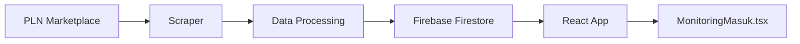
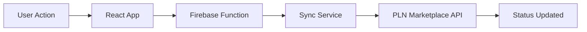

# PLN Marketplace Scraper & Integration

Comprehensive web scraping and bidirectional sync solution for PLN Marketplace integration with material tracking application.

## 🎯 Overview

This project provides:
- **Marketplace Exploration**: Automated discovery of PLN Marketplace structure and capabilities
- **Data Scraping**: Real-time extraction of material tracking data
- **Bidirectional Sync**: Two-way synchronization between marketplace and our application
- **Firebase Integration**: Seamless data storage and real-time updates

## 📋 Features

### 🔍 Exploration Capabilities
- ✅ Automated login and authentication
- ✅ Menu structure discovery
- ✅ Data table analysis
- ✅ API endpoint detection
- ✅ Form element mapping
- ✅ Screenshot capture
- ✅ Network traffic monitoring

### 🔄 Bidirectional Sync
- ✅ **Marketplace → App**: Real-time data pull
- ✅ **App → Marketplace**: Status updates push
- ✅ Conflict resolution strategies
- ✅ Audit logging
- ✅ Error handling and retry logic

### 📊 Data Processing
- ✅ Material tracking synchronization
- ✅ Delivery schedule updates
- ✅ Supplier performance metrics
- ✅ Status change notifications
- ✅ ETA monitoring

## 🚀 Quick Start

### Prerequisites
- Python 3.9+
- Chrome/Chromium browser
- Firebase project setup
- PLN Marketplace credentials

### Installation

1. **Clone and setup**:
```bash
cd pln-marketplace-scraper
pip install -r requirements.txt
```

2. **Configure environment**:
```bash
cp .env.example .env
# Edit .env with your credentials
```

3. **Setup Firebase**:
```bash
# Place your Firebase credentials in config/firebase-credentials.json
mkdir -p config
# Copy your Firebase service account key to config/firebase-credentials.json
```

### 🔍 Run Exploration

```bash
# Basic exploration
python -m src.scraper.explorer your_username your_password

# With custom settings
PLN_USERNAME=your_user PLN_PASSWORD=your_pass python -m src.scraper.explorer
```

### 📊 Exploration Output

The explorer generates:
- **JSON Report**: `exploration_results_YYYYMMDD_HHMMSS.json`
- **Screenshots**: `screenshots/` directory
- **Logs**: `logs/scraper.log`
- **Markdown Report**: Updates to `PLN_MARKETPLACE_EXPLORATION_REPORT.md`

## 📁 Project Structure

```
pln-marketplace-scraper/
├── src/
│   ├── config/
│   │   └── settings.py          # Configuration management
│   ├── scraper/
│   │   ├── explorer.py          # Marketplace exploration tool
│   │   ├── auth.py              # Authentication handling
│   │   ├── extractor.py         # Data extraction logic
│   │   └── sync.py              # Bidirectional sync engine
│   ├── utils/
│   │   ├── logger.py            # Logging utilities
│   │   └── firebase_client.py   # Firebase integration
│   └── main.py                  # Main application entry
├── config/
│   └── firebase-credentials.json # Firebase service account key
├── logs/                        # Application logs
├── screenshots/                 # Captured screenshots
├── requirements.txt             # Python dependencies
├── .env.example                 # Environment template
├── .env                         # Your environment config
├── docker-compose.yml           # Docker deployment
├── Dockerfile                   # Container definition
└── README.md                    # This file
```

## ⚙️ Configuration

### Environment Variables

| Variable | Description | Default |
|----------|-------------|---------|
| `PLN_USERNAME` | Marketplace username | Required |
| `PLN_PASSWORD` | Marketplace password | Required |
| `PLN_MARKETPLACE_URL` | Marketplace base URL | https://marketplace.pln.co.id |
| `FIREBASE_PROJECT_ID` | Firebase project ID | Required |
| `SCRAPING_INTERVAL_MINUTES` | Sync frequency | 30 |
| `HEADLESS_BROWSER` | Run browser headless | true |
| `SAVE_SCREENSHOTS` | Capture screenshots | true |
| `ENABLE_BIDIRECTIONAL_SYNC` | Enable two-way sync | true |

### Sync Configuration

```python
# Status mapping between systems
STATUS_MAPPING = {
    "marketplace_to_app": {
        "PROCCESSED": "processing",
        "PENDING": "pending", 
        "DELIVERED": "delivered",
        "SHIPPED": "in_transit"
    },
    "app_to_marketplace": {
        "received": "DELIVERED",
        "processing": "PROCCESSED", 
        "pending": "PENDING"
    }
}
```

## 🔄 Integration Workflow

### 1. Marketplace → Our App (Data Pull)


### 2. Our App → Marketplace (Status Push)


## 📊 Data Schema

### Material Tracking Collection
```typescript
interface MaterialTracking {
  id: string;
  nomorPO: string;
  supplier: string;
  materialDescription: string;
  
  // Marketplace data
  etd: string;
  eta: string;
  currentStatus: string;
  rating: string;
  
  // Sync metadata
  lastSyncedAt: string;
  source: 'marketplace' | 'app';
  syncDirection: 'pull' | 'push';
}
```

### Sync Logs Collection
```typescript
interface SyncLog {
  id: string;
  timestamp: string;
  operation: 'pull' | 'push';
  status: 'success' | 'error';
  recordsProcessed: number;
  errors: string[];
  duration: number;
}
```

## 🔧 Usage Examples

### Basic Exploration
```python
from src.scraper.explorer import PLNMarketplaceExplorer

explorer = PLNMarketplaceExplorer("username", "password")
results = explorer.run_complete_exploration()

print(f"Found {len(results.accessible_menus)} accessible menus")
print(f"Discovered {len(results.discovered_apis)} API endpoints")
```

### Custom Sync Service
```python
from src.scraper.sync import BidirectionalSync

sync = BidirectionalSync()

# Pull latest data from marketplace
await sync.sync_from_marketplace()

# Push status update to marketplace
await sync.sync_to_marketplace({
    'type': 'material_received',
    'po_number': 'PO-12345',
    'status': 'DELIVERED'
})
```

## 🐳 Docker Deployment

### Build and Run
```bash
# Build image
docker build -t pln-marketplace-scraper .

# Run with environment file
docker run --env-file .env pln-marketplace-scraper

# Or use docker-compose
docker-compose up -d
```

### Docker Compose
```yaml
version: '3.8'
services:
  pln-scraper:
    build: .
    environment:
      - PLN_USERNAME=${PLN_USERNAME}
      - PLN_PASSWORD=${PLN_PASSWORD}
    volumes:
      - ./logs:/app/logs
      - ./screenshots:/app/screenshots
    restart: unless-stopped
```

## 📈 Monitoring & Logging

### Log Levels
- **INFO**: Normal operations
- **WARNING**: Non-critical issues
- **ERROR**: Failed operations
- **DEBUG**: Detailed debugging info

### Metrics Tracked
- Sync success rate
- Response times
- Error frequencies
- Data consistency checks
- Authentication status

## 🔒 Security Considerations

### Credentials Management
- Environment variables for sensitive data
- Firebase service account key protection
- Session token encryption
- Rate limiting compliance

### Data Privacy
- Minimal data collection
- Audit trail logging
- Access control enforcement
- Data retention policies

## 🚨 Troubleshooting

### Common Issues

#### Authentication Failed
```bash
# Check credentials
echo $PLN_USERNAME
echo $PLN_PASSWORD

# Test login manually
python -c "from src.scraper.explorer import PLNMarketplaceExplorer; print(PLNMarketplaceExplorer('user', 'pass').authenticate())"
```

#### Browser Issues
```bash
# Install Chrome dependencies (Linux)
sudo apt-get update
sudo apt-get install -y chromium-browser chromium-chromedriver

# Check Chrome version
google-chrome --version
```

#### Firebase Connection
```bash
# Verify credentials file
ls -la config/firebase-credentials.json

# Test Firebase connection
python -c "import firebase_admin; print('Firebase OK')"
```

### Debug Mode
```bash
# Enable debug logging
export DEBUG_MODE=true
export LOG_LEVEL=DEBUG
export SAVE_SCREENSHOTS=true

# Run with verbose output
python -m src.scraper.explorer --debug
```

## 🤝 Contributing

### Development Setup
```bash
# Install development dependencies
pip install -r requirements.txt

# Install pre-commit hooks
pre-commit install

# Run tests
pytest tests/

# Code formatting
black src/
flake8 src/
```

### Adding New Features
1. Create feature branch
2. Add tests for new functionality
3. Update documentation
4. Submit pull request

## 📝 License

This project is licensed under the MIT License - see the LICENSE file for details.

## 🆘 Support

For issues and questions:
1. Check the troubleshooting section
2. Review logs in `logs/scraper.log`
3. Create an issue with detailed error information
4. Include screenshots and configuration (without credentials)

## 🗺️ Roadmap

### Phase 1: Exploration ✅
- [x] Marketplace structure discovery
- [x] Authentication handling
- [x] Data extraction capabilities
- [x] API endpoint detection

### Phase 2: Basic Sync 🔄
- [ ] Read-only data synchronization
- [ ] Firebase integration
- [ ] Error handling and retry logic
- [ ] Monitoring and logging

### Phase 3: Bidirectional Sync 🎯
- [ ] Status update push to marketplace
- [ ] Conflict resolution
- [ ] Real-time notifications
- [ ] Performance optimization

### Phase 4: Production Ready 🚀
- [ ] Docker deployment
- [ ] Monitoring dashboard
- [ ] Automated testing
- [ ] Documentation completion

---

**Status**: 🔄 In Development  
**Last Updated**: June 11, 2025  
**Version**: 1.0.0-alpha
